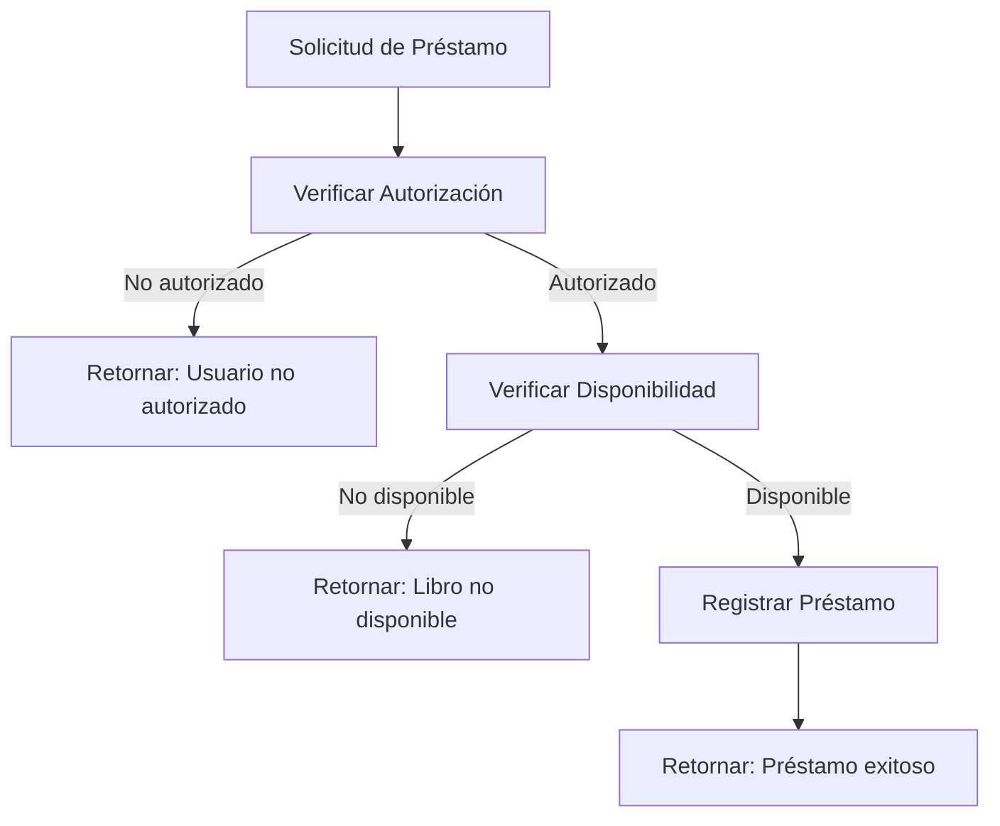

# 📚 Sistema de Biblioteca - Pruebas Top Down

Un sistema de gestión de biblioteca desarrollado en Python que demuestra el desarrollo dirigido por pruebas (TDD) utilizando la metodología **Top-Down Testing**. El sistema maneja operaciones de préstamo de libros con un enfoque en arquitectura limpia a través de inyección de dependencias.

## 🏗️ Arquitectura del Sistema

El sistema implementa **Inyección de Dependencias** como patrón arquitectónico principal. La clase principal `BibliotecaSistema` acepta interfaces de base de datos y autenticación a través de su constructor, permitiendo pruebas flexibles y futura extensibilidad.

### Componentes Principales

- **Lógica de Negocio**: Clase `BibliotecaSistema` maneja el flujo principal de préstamos
- **Capa de Autenticación**: Abstraída a través de interfaz auth para verificación de usuarios
- **Capa de Datos**: Abstraída a través de interfaz de base de datos para disponibilidad y registro de préstamos
- **Stubs de Prueba**: Implementaciones mock predecibles para pruebas aisladas

## 📁 Estructura del Proyecto

```
proyecto_biblioteca/
├── README.md               # Este archivo
├── biblioteca_sistema.py   # Sistema principal de biblioteca
├── test_top_down.py        # Suite de pruebas Top Down
└── stubs/                  # Implementaciones simuladas
    ├── __init__.py
    ├── database_stub.py    # Stub de base de datos
    └── auth_stub.py        # Stub de autenticación
```

## 🚀 Instalación y Configuración

### Prerrequisitos
- Python 3.11+
- pytest (para ejecutar pruebas)

### Instalación
```bash
# Instalar dependencias
pip install pytest

# Clonar/descargar el proyecto
cd proyecto_biblioteca
```

## 🧪 Ejecución de Pruebas

### Ejecutar todas las pruebas
```bash
pytest test_top_down.py -v
```

### Ejecutar pruebas con más detalle
```bash
pytest test_top_down.py -v --tb=short
```

### Ejecutar pruebas específicas
```bash
# Solo pruebas de la clase principal
pytest test_top_down.py::TestBibliotecaSistema -v

# Prueba específica
pytest test_top_down.py::test_prestamo_exitoso -v
```

## 📖 Uso del Sistema

### Ejemplo Básico
```python
from biblioteca_sistema import BibliotecaSistema
from stubs.database_stub import DatabaseStub
from stubs.auth_stub import AuthStub

# Configurar stubs
db_stub = DatabaseStub()
auth_stub = AuthStub()

# Crear sistema con inyección de dependencias
sistema = BibliotecaSistema(db_stub, auth_stub)

# Realizar préstamo
resultado = sistema.prestar_libro(usuario_id=1, libro_id=2)
print(resultado)  # "Préstamo exitoso"
```

## 🎯 Metodología Top-Down Testing

### Principios Implementados
1. **Stubs Predecibles**: Comportamientos deterministas para pruebas consistentes
2. **Pruebas de Integración**: Se enfocan en escenarios de integración vs pruebas de componentes individuales
3. **Separación Clara**: Fases de setup, ejecución y assertion bien definidas

### Comportamiento de los Stubs

#### AuthStub
- ✅ **Usuarios autorizados**: ID > 0 
- ❌ **Usuarios no autorizados**: ID = 0

#### DatabaseStub  
- ✅ **Libros disponibles**: ID par (2, 4, 6, 8...)
- ❌ **Libros no disponibles**: ID impar (1, 3, 5, 7...)
- 📝 **Registro**: Todos los préstamos se registran exitosamente

## 🔄 Flujo de Lógica de Negocio



## ✅ Casos de Prueba Cubiertos

| Escenario | Usuario ID | Libro ID | Resultado Esperado |
|-----------|------------|----------|-------------------|
| Flujo exitoso | 1 | 2 | "Préstamo exitoso" |
| Usuario no autorizado | 0 | 2 | "Usuario no autorizado" |
| Libro no disponible | 1 | 3 | "Libro no disponible" |
| Múltiples usuarios válidos | 1,2,5,10,99 | 4 | "Préstamo exitoso" |
| Múltiples libros no disponibles | 1 | 1,3,5,7,9 | "Libro no disponible" |

## 🏛️ Patrones de Diseño

### Inyección de Dependencias
```python
class BibliotecaSistema:
    def __init__(self, db, auth):
        self.db = db      # Interfaz de base de datos
        self.auth = auth  # Interfaz de autenticación
```

### Strategy Pattern (Implícito)
Los stubs implementan las mismas interfaces que las implementaciones reales futuras, permitiendo intercambio transparente.

## 🔧 Desarrollo y Extensibilidad

### Añadir Nuevas Funcionalidades
1. Extender la clase `BibliotecaSistema` con nuevos métodos
2. Actualizar stubs para soportar nuevos comportamientos
3. Crear pruebas Top-Down para los nuevos flujos

### Reemplazar Stubs con Implementaciones Reales
```python
# En lugar de stubs, usar implementaciones reales
from database_real import DatabaseReal
from auth_real import AuthReal

sistema = BibliotecaSistema(DatabaseReal(), AuthReal())
```

## 📊 Resultados de Pruebas

```
============================= test session starts ==============================
collected 7 items

test_top_down.py::TestBibliotecaSistema::test_prestamo_exitoso PASSED    [ 14%]
test_top_down.py::TestBibliotecaSistema::test_usuario_no_autorizado PASSED [ 28%]
test_top_down.py::TestBibliotecaSistema::test_libro_no_disponible PASSED [ 42%]
test_top_down.py::TestBibliotecaSistema::test_multiples_usuarios_autorizados PASSED [ 57%]
test_top_down.py::TestBibliotecaSistema::test_multiples_libros_no_disponibles PASSED [ 71%]
test_top_down.py::test_prestamo_exitoso PASSED                           [ 85%]
test_top_down.py::test_usuario_no_autorizado PASSED                      [100%]

============================== 7 passed in 0.05s ===============================
```

## 🤝 Contribución

1. Fork el proyecto
2. Crea una rama para tu feature (`git checkout -b feature/nueva-funcionalidad`)
3. Asegúrate de que todas las pruebas pasen (`pytest`)
4. Añade pruebas para nuevas funcionalidades
5. Commit tus cambios (`git commit -am 'Añadir nueva funcionalidad'`)
6. Push a la rama (`git push origin feature/nueva-funcionalidad`)
7. Abre un Pull Request

## 📝 Notas de Implementación

- **Sin dependencias externas**: El sistema usa solo la biblioteca estándar de Python
- **Altamente portable**: Funciona en cualquier entorno Python 3.11+
- **Preparado para producción**: Arquitectura escalable y mantenible
- **Test-friendly**: Diseñado para facilitar pruebas automatizadas

## 📚 Recursos Adicionales

- [Documentación de pytest](https://docs.pytest.org/)
- [Patrones de Inyección de Dependencias en Python](https://python-dependency-injector.ets-labs.org/)
- [Metodología Top-Down Testing](https://en.wikipedia.org/wiki/Top-down_and_bottom-up_design)

---

**Desarrollado como demostración de pruebas Top-Down y arquitectura limpia en Python** 🐍